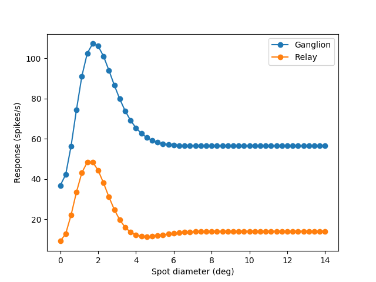

.. _einevoll_2000:

Spatial receptive-field of nonlagged cells in dLGN of cat
=========================================================
In this example script some of the results in `Einevoll et al. (2000) <https://www.cambridge.org/core/services/aop-cambridge-core/content/view/S0952523800176060/>`_ is reproduced (figure 5).
In this script the summation curve for ganglion cell and relay cell is calculated. The resulting figure is shown below:

   Area summation curve for OFF-center ganglion cell and relay cell with dark spot stimulus.

The script creating this figure is shown below:

.. literalinclude:: ../../../examples/einevoll_2000.py
    :language: python
