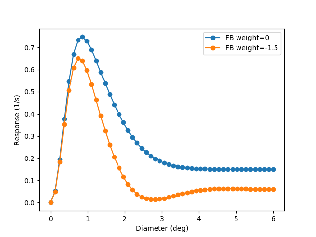
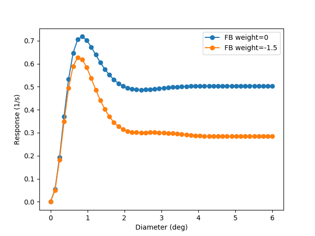

.. _einevoll_2012:

Extended DoG model with cortical feedback
=========================================
In this example figure 6 in `Einevoll et al. (2012) <http://link.springer.com/article/10.1007/s11571-011-9183-8>`_ is reproduced, where the response of the extended difference of Gaussians (eDoG) model to flashing-spot is calculated. The resulting figure is shown below:

   Flashing-spot response as a function of spot diameter for different feedback weights.

.. literalinclude:: ../../../examples/einevoll_2012.py
    :language: python

The response to patch-grating can be calculated using the same code with a small modification in stimulus: :code:`wavenumber=integrator.spatial_angular_freqs[4]` which corresponds to wavenumber ~2.0/deg.

   Patch-grating response (wavenumber ~2.0/deg) as a function of spot diameter for different feedback weights.
