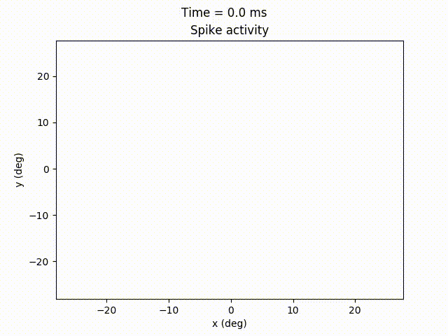
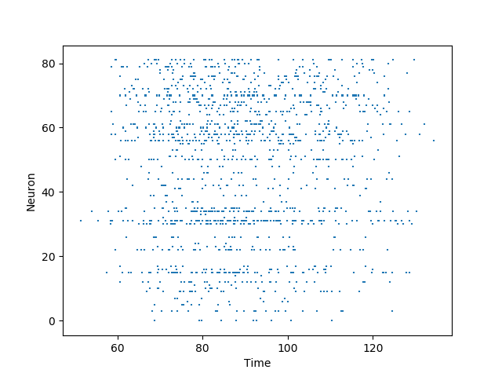

.. _generate_spiketrain:

Generate spike trains
=====================

In this example a static image is shown in 80 ms after a 40 ms delay.

.. literalinclude:: ../../../examples/generate_spiketrain.py
    :language: python
    :lines: 1-26

The calculated rates can be converted to spikes via a nonstationary Poisson process:

.. literalinclude:: ../../../examples/generate_spiketrain.py
    :language: python
    :lines: 28-42

In the animation below the generated spikes at each location are shown as dots:

A simple raster plot of individual locations can be created using:

.. literalinclude:: ../../../examples/generate_spiketrain.py
    :language: python
    :lines: 44

