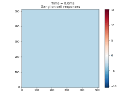

.. _natural_stimulus:

Using natural scenes and natural movies as stimulus
===================================================

Natural scene
''''''''''''''
In this example a static image is shown in 80 ms after a 40 ms delay.

.. literalinclude:: ../../../examples/natural_stimulus.py
    :language: python

The response is shown below:

Natural movie
''''''''''''''
Natural movies can be given as GIFs:

.. code-block:: python

          stimulus = pylgn.stimulus.create_natural_movie(filename="natural_scene.gif")

.. note::
    If GIF file do not have a "duration" key (time between frames) 30 ms is used by default. See `Pillow documentation <http://pillow.readthedocs.io/en/3.1.x/handbook/image-file-formats.html>`_ for details.
